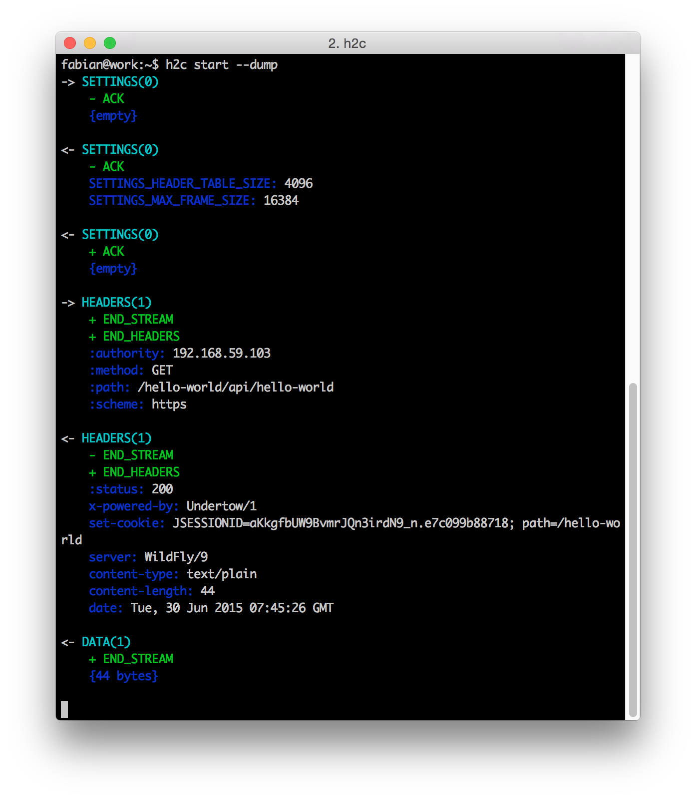
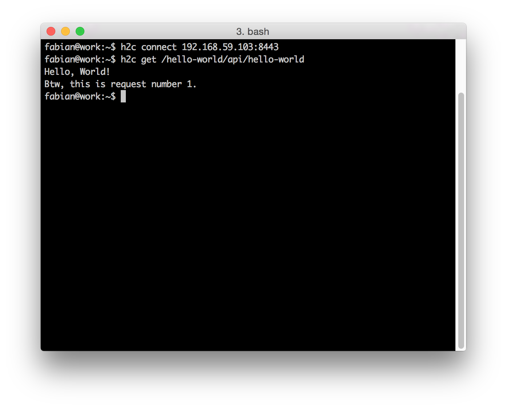

h2c - A Simple HTTP/2 Command-Line Client
-----------------------------------------

`h2c` is a simple HTTP/2 command-line client, like `curl`.

While `curl` terminates after each request/response cycle, `h2c` runs a background process to keep connections open.
That way, `h2c` may receive asynchronous [push](https://httpwg.github.io/specs/rfc7540.html#PushResources) messages from the server.

`h2c` is currently in a very early stage. The best way to learn about it is to read the blog posts on [http://unrestful.io](http://unrestful.io).

Screenshots
-----------





Basic Usage
-----------

```bash
h2c start &
h2c connect http2.akamai.com
h2c get /index.html
h2c stop
```

Command Overview
----------------

For a complete list of available commands, run `h2c --help`.

* `h2c start [options]` Start the h2c process. The h2c process must be started before running any other command.
* `h2c connect [options] <host>:<port>` Connect to a server using https
* `h2c disconnect` Disconnect from server
* `h2c get [options] <path>` Perform a GET request
* `h2c post [options] <path>` Perform a POST request
* `h2c set <header-name> <header-value>` Set a header. The header will be valid for all subsequent requests.
* `h2c unset <header-name> [<header-value>]` Undo 'h2c set'.
* `h2c pid` Show the process id of the h2c process.
* `h2c push-list` List responses that are available as push promises.
* `h2c stop` Stop the h2c process
* `h2c wiretap <localhost:port> <remotehost:port>` Listen on localhost:port and forward all traffic to remotehost:port.

How to Download and Run
-----------------------

Binary releases are available on the [GitHub Releases](https://github.com/fstab/h2c/releases).

1. Download the latest release ZIP file: [h2c-v0.0.7.zip](https://github.com/fstab/h2c/releases/download/v0.0.7/h2c-v0.0.7.zip)
2. Extract the ZIP file
3. Find the executable for your system in the `bin` folder:
  * Linux: `h2c_linux_amd64`
  * OS X: `h2c_darwin_amd64`
  * Windows: `h2c_windows_amd64.exe`
4. Rename that executable to `h2c`, or `h2c.exe` on Windows
5. Move the executable into a folder on your PATH.

How to Build from Source
------------------------

`h2c` is developed with [go 1.4.2](https://golang.org/dl/). With [go](https://golang.org) set up, you can download, compile, and install `h2c` as follows:

```bash
go get github.com/fstab/h2c
```

Related Work
------------

`h2c` uses parts of Brad Fitzpatrick's [HTTP/2 support for Go](https://github.com/bradfitz/http2). There is an HTTP/2 console debugger included in [bradfitz/http2](https://github.com/bradfitz/http2), but just like `h2c`, it is currently only a quick few hour hack, so it is hard to tell if they aim at the same kind of tool.

LICENSE
-------

`h2c` is licensed under the [Apache License, Version 2.0](LICENSE).

`h2c` is implemented in [Go](https://golang.org) and uses Go's [standard library](https://golang.org/pkg/#stdlib), which is licensed under [Google's Go license](https://code.google.com/p/go/source/browse/LICENSE), which is a variant of the [BSD License](https://en.wikipedia.org/wiki/BSD_licenses).

The following 3rd party libraries are used:

  * `github.com/fstab/http2/hpack` is cloned from `github.com/bradfitz/http2/hpack`. It implements the [Header Compression for HTTP/2 (HPACK)](https://httpwg.github.io/specs/rfc7541.html). The library is licensed  [under the terms of Go itself](https://github.com/fstab/http2/blob/master/LICENSE).
  * `github.com/fstab/color` is cloned from `github.com/fatih/color`. It implements the color output used in `h2c start --dump`. The library is licensed under an [MIT License](https://github.com/fstab/color/blob/master/LICENSE.md).
